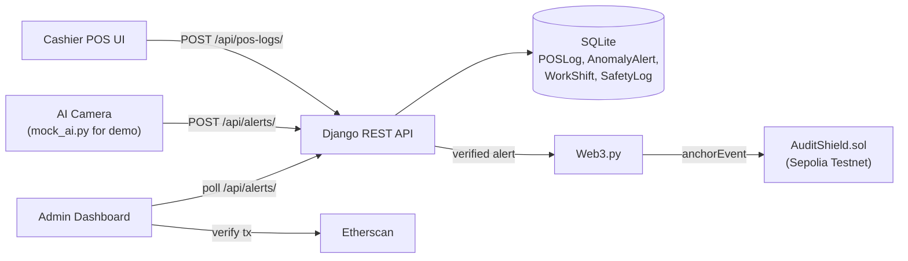
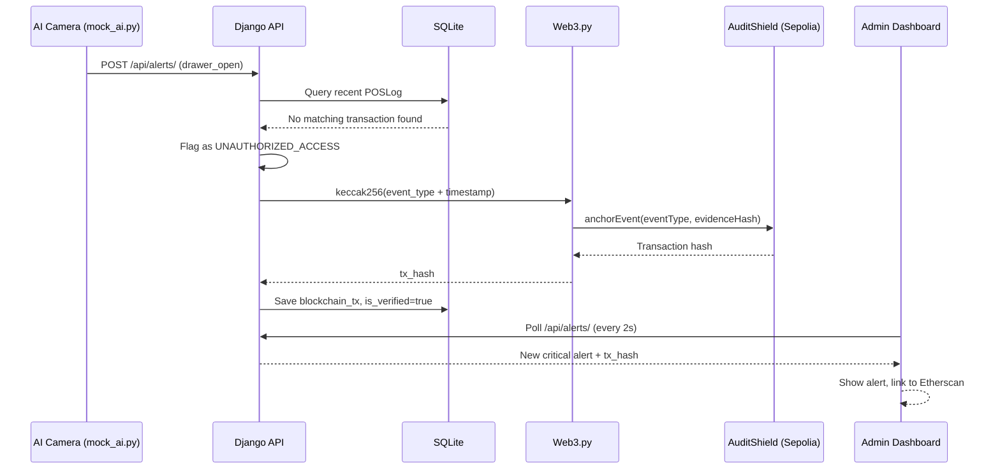

# Sentinel GEC (Guard. Evidence. Chain.)

A retail security system that cross-references AI-detected anomalies with POS transaction logs and anchors verified incidents to the Ethereum Sepolia testnet for tamper-proof evidence.


Built for Hack.X / HackTheSpring '26 (Top 12 Finalist).

## Table of Contents

- [Overview](#overview)
- [Problem Statement](#problem-statement)
- [Solution](#solution)
- [Features](#features)
- [Architecture](#architecture)
- [Tech Stack](#tech-stack)
- [Project Structure](#project-structure)
- [System Workflow](#system-workflow)
- [Installation](#installation)
- [Configuration](#configuration)
- [Running Locally](#running-locally)
- [API Documentation](#api-documentation)
- [Blockchain Architecture](#blockchain-architecture)
- [Author](#author)

## Overview

Sentinel GEC monitors retail point-of-sale activity for anomalies such as unauthorized cash drawer access, cross-references them against the store's own transaction log, and anchors verified incidents on-chain so the evidence record can't be altered or deleted after the fact.

## Problem Statement

Retail theft and cash drawer fraud are hard to prove after the fact: local video and log records can be edited or deleted, and matching a suspicious camera event to a legitimate sale (or the lack of one) is normally a manual, after-the-fact investigation.

## Solution

A Django backend receives POS transaction logs and AI anomaly alerts through separate API endpoints, and a rules engine flags anomalies with no matching transaction within a short time window as unauthorized. Verified alerts are hashed and anchored to a smart contract on Sepolia via Web3.py, so the incident record is provable even if the local database is later wiped. A cashier-facing POS UI and an admin dashboard (with live blockchain verification links) round out the system.

## Features

| Feature | Description |
|---|---|
| Anomaly-to-transaction matching | Flags an anomaly (e.g. drawer open) as unauthorized if no matching POS transaction exists within a short time window |
| Blockchain evidence anchoring | Hashes and anchors verified alert metadata to the `AuditShield` smart contract on Sepolia |
| Shift and cash reconciliation | Tracks cashier work shifts, expected vs. actual cash, and flags discrepancies |
| Safety mode | Cashiers can toggle a "safety mode" during legitimate drawer access to suppress false-positive alerts, tracked per shift |
| Live admin dashboard | Polls for new alerts, shows critical/warning notifications, and links directly to Etherscan for on-chain verification |
| Cashier POS UI | Lightweight HTML/JS interface for logging sales and shift start/end |
| Mock AI engine | A standalone script (`mock_ai.py`) that simulates camera-detected anomaly events for demo purposes |

## Architecture



## Tech Stack

| Layer | Technology |
|---|---|
| Backend | Django, Django REST Framework |
| Database | SQLite |
| Blockchain | Web3.py, Solidity, Ethereum Sepolia testnet |
| Frontend | HTML5, CSS3, vanilla JavaScript |
| AI simulation | Standalone Python script (`mock_ai.py`) simulating camera-detected events |

## Project Structure

```
GEC/
├── backend/
│   ├── core/                  # Django project settings and URL config
│   ├── sentinel/
│   │   ├── models.py          # POSLog, AnomalyAlert, WorkShift, SafetyLog
│   │   ├── views.py           # API logic + Sepolia anchoring on alert creation
│   │   ├── blockchain_utils.py
│   │   └── serializers.py
│   └── AuditShield.sol        # Smart contract deployed to Sepolia
├── admin-frontend/
│   └── admin-dashboard.html   # Live alert dashboard with on-chain verification
├── cashier-frontend/
│   └── cashier-pos.html       # POS UI for logging sales and shifts
├── mock_ai.py                 # Simulates AI camera anomaly events
├── start_demo.sh              # One-click demo launcher
└── DOCUMENTATION.md           # Technical documentation and data flow
```

## System Workflow

Example scenario: an unauthorized cash drawer opening.



## Installation

**Prerequisites:** Python 3.10+, a Sepolia RPC endpoint (e.g. Infura or Alchemy), a funded Sepolia test wallet

```bash
git clone https://github.com/KAVYAJOSHI1/GEC.git
cd GEC
python3 -m venv backend/venv
source backend/venv/bin/activate
pip install django djangorestframework web3 python-decouple
```

> No `requirements.txt` is currently included in the repository; the command above installs the packages actually imported by the backend (`django`, `djangorestframework`, `web3`, `python-decouple`).

## Configuration

Create a `.env` file in `backend/` (gitignored, not committed):

```env
SEPOLIA_RPC_URL=https://sepolia.infura.io/v3/YOUR_KEY
PRIVATE_KEY=0xYOUR_PRIVATE_KEY
CONTRACT_ADDRESS=0xYOUR_DEPLOYED_CONTRACT_ADDRESS
CONTRACT_ABI=[ ... the AuditShield ABI JSON ... ]
```

The contract address and ABI correspond to `AuditShield.sol` deployed on Sepolia.

## Running Locally

**One-click demo:**
```bash
./start_demo.sh
```
Starts the Django backend on port 8000 and opens the Cashier POS and Admin Dashboard in your browser.

**Simulate AI alerts** (in a new terminal, since no live camera is connected):
```bash
./backend/venv/bin/python mock_ai.py
```
Choose `1` for an unauthorized drawer open (critical alert + blockchain transaction) or `2` for a hand-to-pocket event (warning alert).

**Verify on-chain:** open the Admin Dashboard, click "Verify on Chain" on a critical alert, then follow the Etherscan link to view the immutable Sepolia transaction.

## API Documentation

| Method | Endpoint | Description |
|---|---|---|
| GET | `/api/pos-logs/` | Fetch recent POS transaction logs |
| POST | `/api/pos-logs/` | Log a new sale (cash/UPI/card) |
| GET | `/api/alerts/` | Fetch security alerts, including blockchain tx hashes |
| POST | `/api/alerts/` | Submit a new anomaly alert; triggers the matching + anchoring logic |
| GET / POST | `/api/shifts/` | List or create cashier work shifts |
| POST | `/api/shifts/start/` | Start a new shift (closes any existing active shift) |
| POST | `/api/shifts/end/` | End the active shift and calculate cash discrepancy |
| GET | `/api/shifts/current/` | Get the active shift with real-time expected cash |
| GET / POST | `/api/safety-logs/` | List or log safety-mode on/off events tied to a shift |

## Blockchain Architecture

`AuditShield.sol`, deployed on the Sepolia testnet, exposes a single function:

```solidity
function anchorEvent(string memory _type, string memory _hash) public
```

Each call stores a `SecurityEvent` (event type, evidence hash, timestamp, reporting address) in an on-chain mapping and emits an `EventAnchored` event. On the backend, `AlertViewSet.create()` computes the evidence hash as `keccak256(anomaly_type + timestamp)`, signs and sends the transaction via `Web3.py`, then stores the resulting transaction hash on the `AnomalyAlert` record for the admin dashboard to link to Etherscan.

## Author

**Kavya Joshi**
[Portfolio](https://kavyajoshi1.github.io/) · [LinkedIn](https://linkedin.com/in/kavya-joshi-3765742b0) · [GitHub](https://github.com/KAVYAJOSHI1)
